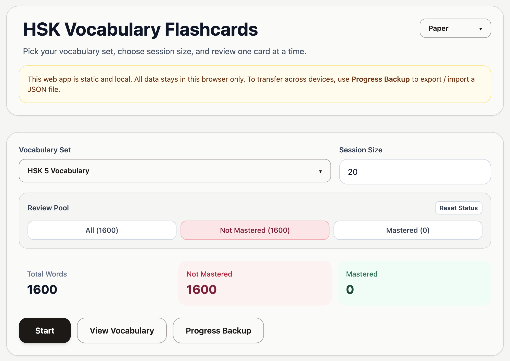
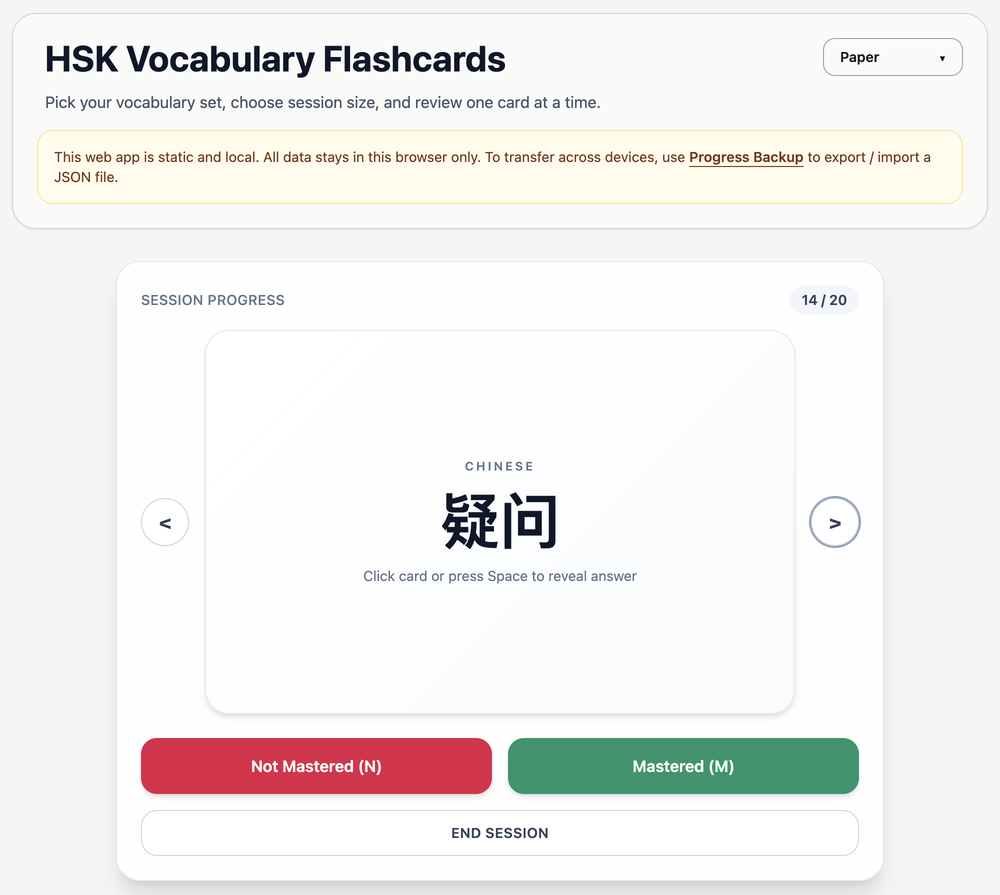

# HSK Vocabulary Flashcards

A simple browser-based HSK vocabulary flashcard app built with React and Vite.

<div>
  
</div>

## 1. Clone the Repository

```bash
git clone https://github.com/Leviathan121005/hsk-vocabulary-learning-flashcards.git
```

## 2. Install and Run Locally

```bash
npm install
npm run dev
```

Open the local URL shown in terminal (usually http://localhost:5173).

## 3. Build for Production

```bash
npm run build
npm run preview
```

## 4. How to Use

### Session Setup

1. Choose an HSK vocabulary set
2. Set your session size
3. Click **Start** to begin

### Session Controls

<div style="margin-bottom: 10px;">
  
</div>

| Keyboard | Action |
|----------|--------|
| <kbd>Space</kbd> | Flip card |
| <kbd>←</kbd> / <kbd>→</kbd> | Previous / next card |
| <kbd>N</kbd> | Mark as `Not Mastered` |
| <kbd>M</kbd> | Mark as `Mastered` |
> Or use the buttons on the screen

End session by marking the last word or by clicking **End Session**.

</div>

### Other Features

- Click **View Vocabulary** to search, review, and manually mark vocabularies.
- Use **Progress Backup** to export / import your progress data.

## 5. Notes

- This app is frontend-only.
- Progress is stored in your browser localStorage.
- No account login nor cloud sync.