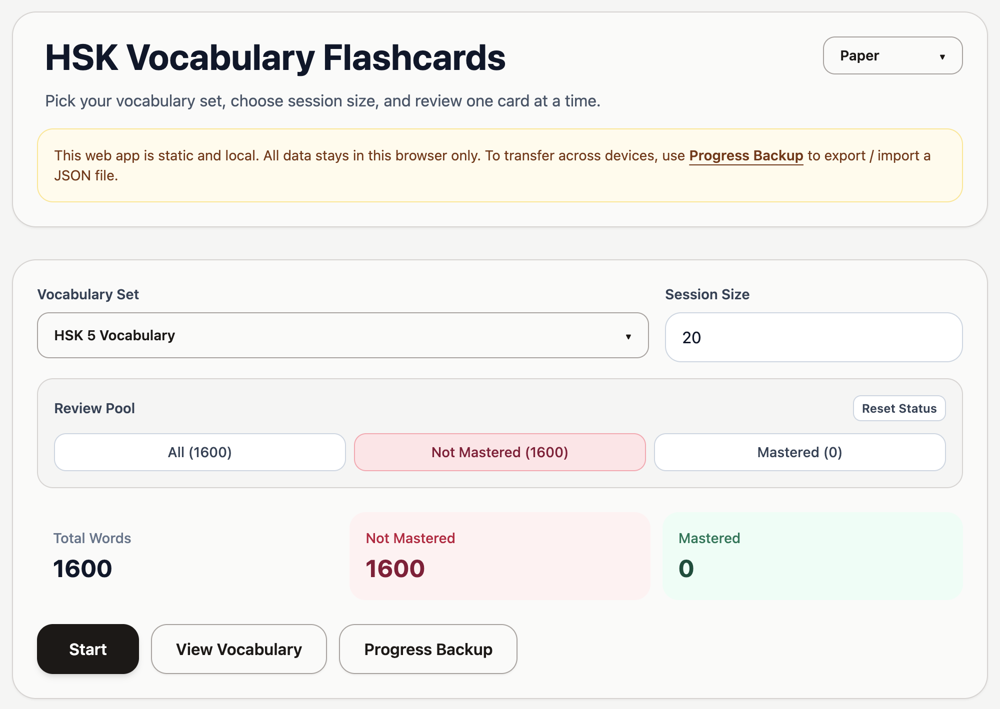
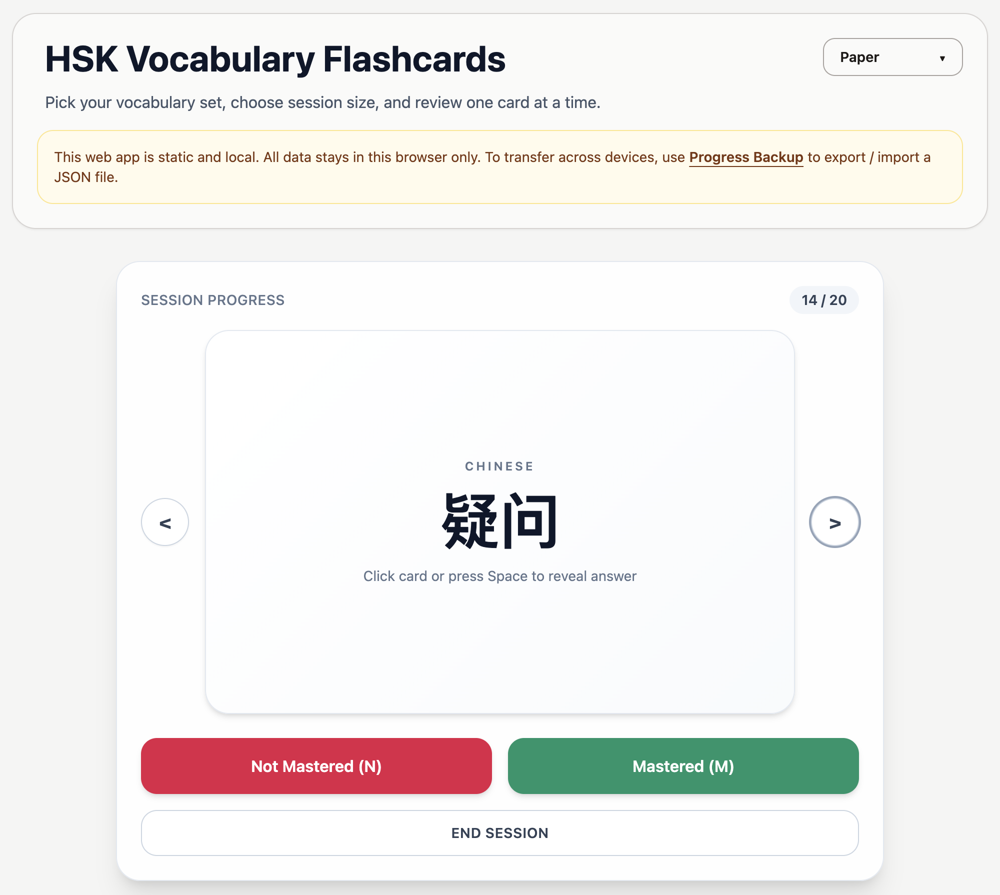

# HSK Vocabulary Flashcards

A simple browser-based flashcard app for tracking and reviewing HSK vocabulary, built with React and Vite.

<div>
  
</div>

## 1. Clone the Repository

```bash
git clone https://github.com/Leviathan121005/hsk-vocabulary-learning-flashcards.git
```

## 2. Install and Run Locally

```bash
npm install
npm run dev
```

Open the local URL shown in terminal (usually http://localhost:5173).

## 3. Build for Production

```bash
npm run build
npm run preview
```

## 4. How to Use

### Session Setup

1. Choose an HSK vocabulary set
2. Set your session size
3. Click **Start** to begin

### Session Controls

<div style="margin-bottom: 10px;">
  
</div>

| Keyboard | Action |
|----------|--------|
| <kbd>Space</kbd> | Flip card |
| <kbd>←</kbd> / <kbd>→</kbd> | Previous / next card |
| <kbd>N</kbd> | Mark as `Not Mastered` |
| <kbd>M</kbd> | Mark as `Mastered` |
> Or use the buttons on the screen

End session by marking the last word or by clicking **End Session**.

</div>

### Other Features

- Click **View Vocabulary** to search, review, and manually mark vocabularies.
- Use **Progress Backup** to export / import your progress data.

## 5. Notes

- This app is frontend-only.
- Progress is stored in your browser localStorage.
- No account login nor cloud sync.

## 6. Visual Similarity Detection

Use one script, one method at a time:

```bash
python3 scrap/detect_similarity.py --method <glyph|ssim|fusion|intersect> --threshold <float> --max-stroke-gap <int>
```

This script updates `public/character_info.json` by replacing
`similar_visual_chars` with results from the chosen method only.

Fusion mode now uses the previous `cv` behavior:

- `score = glyph_score + 1.5 * ssim_score`
- candidate is kept if `score >= --threshold`

Intersect mode uses the previous strict threshold agreement behavior:

- supply `--glyph-threshold` and/or `--ssim-threshold`
- candidate must pass all provided thresholds

Every method applies:

1. Score threshold filter
2. Stroke-count difference filter

Each output candidate includes:

- `score`
- `stroke_count_difference`
- Method-specific score field (`glyph_score`, `ssim_score`, `fusion_score`)

Examples:

```bash
# Glyph (MobileNet)
python3 scrap/detect_similarity.py --method glyph --threshold 0.88 --max-stroke-gap 2

# SSIM
python3 scrap/detect_similarity.py --method ssim --threshold 0.60 --max-stroke-gap 3

# Fusion (combined Glyph + weighted SSIM)
python3 scrap/detect_similarity.py --method fusion --threshold 1.70 --max-stroke-gap 4

# Intersect (strict threshold agreement)
python3 scrap/detect_similarity.py --method intersect --glyph-threshold 0.80 --ssim-threshold 0.60 --max-stroke-gap 4

# Single character dry-run
python3 scrap/detect_similarity.py --method glyph --threshold 0.88 --max-stroke-gap 2 --character 好 --dry-run
```

Optional method-specific settings:

- Glyph: `--glyph-metric cosine|euclidean|tanh`, `--glyph-font`, `--glyph-device`
- SSIM: `--ssim-size`, `--ssim-cache`, `--refresh-ssim-cache`
- Fusion: uses combined score and supports `--threshold` in `[-2.5, 2.5]`
- Intersect: threshold flags `--glyph-threshold` and `--ssim-threshold`

Notes:

- There are no IDS or Four-Corner modes in this simplified version.
